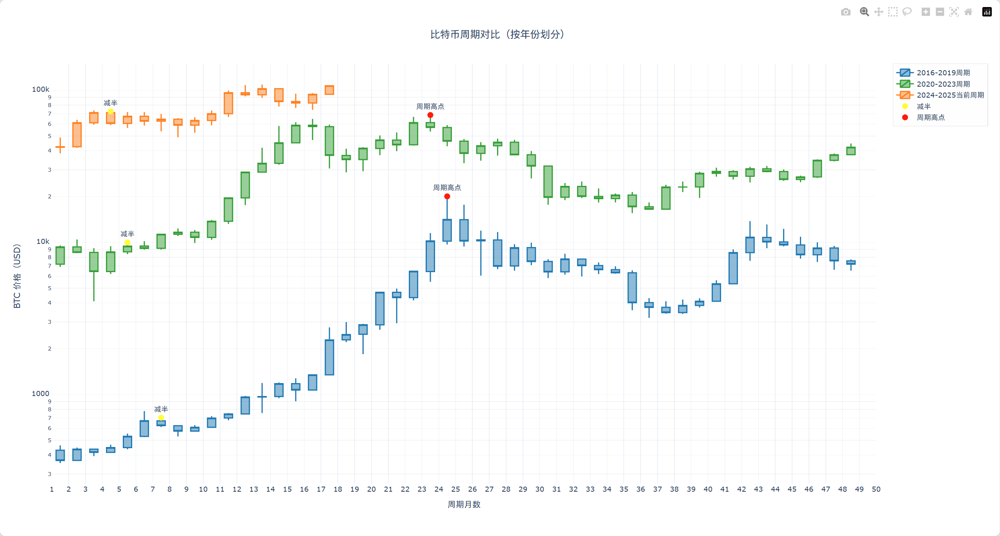

# 🚀 比特币周期对比图表 (Bitcoin Cycle Comparison Chart)

📊 一个用于生成比特币减半周期对比图表的简单工具，支持多种输出格式。



## ✨ 功能特点

- 📈 展示多个比特币减半周期的价格走势对比
- 🔍 突出显示关键时间点（减半时间和周期高点）
- 💡 支持交互式悬停信息，显示详细的时间和价格数据
- 🎨 使用清晰的浅色主题，提高可读性
- 📑 生成交互式图表：HTML

## 🛠️ 安装依赖

```bash
pip install -r requirements.txt
```

## 🔧 使用方法

1. 克隆此仓库
2. 安装依赖
3. 运行主脚本

```bash
python btc_cycles_plot.py
```

## 📊 输出示例

脚本会生成以下文件：
- `btc_cycles_comparison.html` - 交互式图表

## 📋 数据来源

数据通过 yfinance 库从 Yahoo Finance 获取比特币历史价格数据 (BTC-USD)。

## 📝 许可证

MIT 许可证
